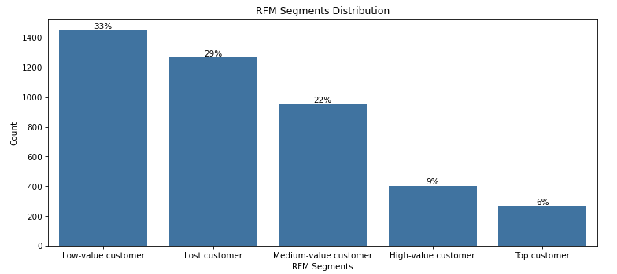
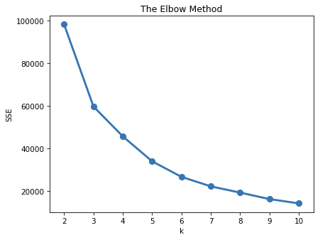
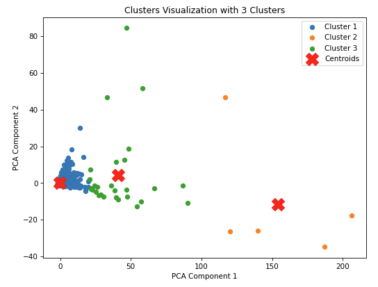
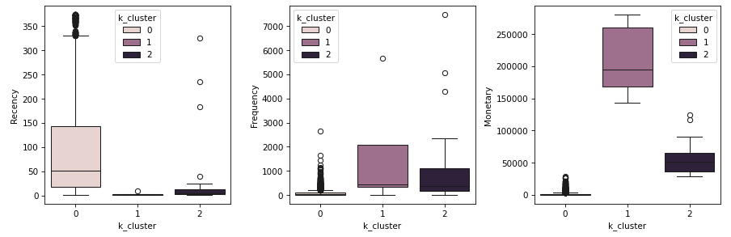

# Unsupervised Clustering - RFM Online Retail
This project uses a dataset sourced from [UCI](https://archive.ics.uci.edu/dataset/352/online+retail).

## Overview
This is a transnational data set which contains all the transactions occurring between 01/12/2010 and 09/12/2011 for a UK-based and registered non-store online retail.The company mainly sells unique all-occasion gifts. Many customers of the company are wholesalers.

## Setup and Installation
1. Clone this repository to your local machine.
2. Ensure you have Python installed.
3. Install the required libraries using the following command:
pip install -r requirements.txt

## Model and Data 
Customers are segmented based on purchasing behavior using Recency, Frequency, and Monetary (RFM) analysis combined with an unsupervised learning algorithm (KMeans).

### Data Cleaning 
The raw data included 541909 records. 135080 records with null values were dropped, 8905 records with Quantity less than zero were dropped, and finally 5192 duplicated records were dropped. 

Additionally, the data was aggregated by Quantity and Sales (UnitPrice * Quantity), resulting in a final dataset before model building with 387877 records. 

### RFM Analysis

RFM score was calculated for each unique CustomerID using the rank method and the following formula: 

RFM Score = Recency Score (Recency Rank * Recency Weight) + Frequency Score (Frequency Rank * Frequency Weight) + Monetary Score (Monetary Rank * Monetary Weight)

### Preprocessing

The RFM data was scaled using RobustScaler, as there are many outliers in the data for which robust scaler was determined as the best scaling approach. 

### Model Building
K-Means with the Elbow Method and Silhouette Scores were used to find three as the best number of clusters.  

PCA was then used to visualize the three clusters in a 2-dimensional space. 

Boxplots helped in visualizing the clusters and providing the following insights after appending them to the RFM dataframe. 

**Cluster 0 - Dormant Customers** represents customers who haven't purchased in a while, as indicated by high recency, make infrequent purchases, and have low monetary value  

These could be churned or inactive customers the company could target with a reactivation campain to re-engage them. The company could better understand these customers through surveys, then offer discounts or special offers. 

**Cluster 1 - VIP Customers** customers have made very recent purchases and are the most frequent buyers, as well as have the highest monetary value

These are the customers to target with VIP treatment, such as dedicated customer service or exclusive offers, focusing on retention strategies to ensure they continue to feel valued and appreciated. With their high monetary value, these customers could also repond well to cross-selling or upselling techniques to introduce them to complimentary products.

**Cluster 2 - Loyal Customers** includes customers who purchased somewhat recently, make frequent purchases, and have high monetary value  

The company could reward these customers through loyalty programs and offer personalized recommendations based on their purchasing history.

## Contributing
Contributions to this project are welcome. Please fork the repository and submit a pull request with your changes.

## License
This project is open source and available under the MIT License.

